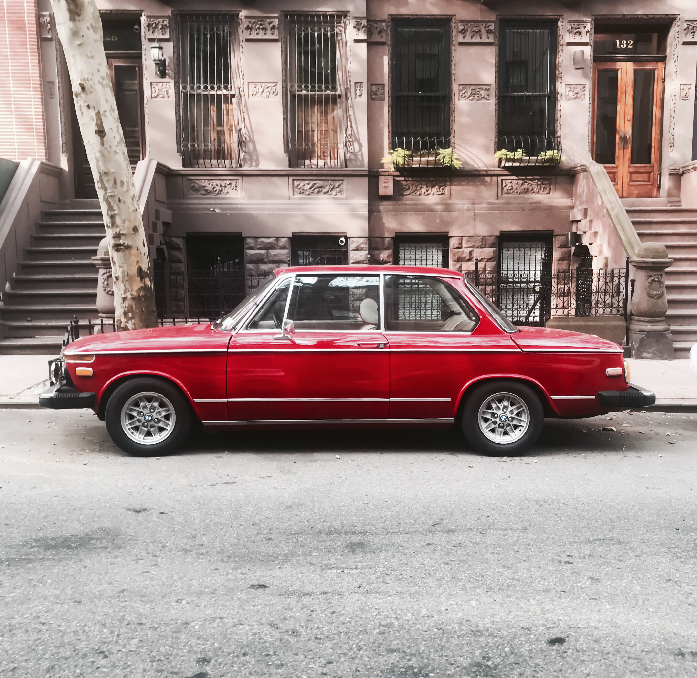

# The & Garage — Site Brief (V1)

> **Source-of-truth specification for building this website.**
> Replit AI agent: read in full before generating code. Reference sections by number (e.g., "§04") when chunking work.
> The styled HTML version lives at `site-brief.html` for human review.

| | |
|---|---|
| **Site** | The & Garage |
| **Operator** | Tim Young |
| **URL** | andgarage.com (TBD — confirm) |
| **Stack** | Static HTML + CSS + minimal JS (no framework) |
| **Era** | 1966 to 1999 |
| **Pages (V1)** | 5 — Home · About Tim · How it works · Gallery · Contact |
| **Built by** | Kendra + Replit AI agent |
| **Hosting** | GitHub Pages (existing) or Replit Deploy |
| **Timeline** | 2 — 4 weeks to live V1 |

## How to use this brief

1. Read sections 1 – 5 first for context (project, audience, voice, brand system, sitemap).
2. When building, work primarily from §06 (page briefs), §07 (components), §08 (copy).
3. Use real copy in §08 **verbatim**. Do not paraphrase. If a slot needs copy not provided, leave `[NEEDS COPY]` as a placeholder.
4. Refer to §10 for tech constraints. **Do not** add frameworks, build tools, or libraries.
5. Refer to §12 before suggesting any "extras" — the line is bright.

---

## §01 · Project & goals

The & Garage is an acquisition concierge for enthusiasts buying classic and modern-classic cars from 1966 to 1999. End-to-end service: intake → search → vet → negotiate → transport → handoff. Tim Young is the operator. The brand is a sibling to his existing recruiting practice, The & Network.

### What is the site for?

- **Primary job (V1) — Validation tool.** A credible URL Tim sends to people in his network when setting up validation conversations. The site makes the conversation easier to have.
- **Secondary job (Phase 2) — Lead-gen surface.** Once Tim has 3 – 5 engagements behind him, the site becomes the front door for enthusiasts who don't know him yet.
- **Always — Tim's brand.** The site is an extension of Tim's personal credibility. His name, voice, eye, story.

### Success metrics for V1

- **Convert intent into conversation.** When a network friend lands on the site, they finish on the Contact page or send Tim an email. Target: 1 of 3 referred visitors completes an inquiry in the first 90 days.
- **Communicate Tim's specific competence.** Visitors leave knowing the era (1966 to 1999), the approach (end-to-end), the eye (gallery + story).
- **Hold up under enthusiast scrutiny.** No lorem, no stock-photo defaults, no generic "concierge" copy. If the BMW E30 forum lands here, no eye-rolls.

### Non-negotiable

**Tim is the protagonist.** The site is not a generic concierge service site with Tim's name on it — it's a site about Tim that happens to offer a service. Every page passes this test: *could anyone else's name be substituted here without changing what's said?* If yes, it's wrong.

### Phase 2 (deferred)

Search-engine optimization, journal/blog, Instagram embed (replaces gallery), newsletter + email engine, Airtable-driven gallery feed. Build hooks for these in V1 (extensible structure, semantic HTML, named slots), do not implement.

---

## §02 · Audience

Two cohorts at launch — Tim's network in V1, self-found enthusiasts in Phase 2. Both are knowledgeable about cars; neither is a corporate buyer.

### Cohort 1 — Tim's network (V1 primary)

- **Who:** People Tim knows directly or one degree removed. Northeast US enthusiasts. Some have bought classics before; many haven't. They trust Tim or trust someone who does.
- **How they arrive — three direct paths, all skipping search:**
  - **Direct URL share** — Tim sends a text, email, or message during a conversation. Most common.
  - **Business card with QR code** — Tim hands out at car shows, cruise-ins, enthusiast events. Scan → site.
  - **Flyer with QR code** — posted at high-end independent mechanic shops in the Northeast (BMW, Porsche, vintage specialists). Scan → site.
- **Phone-first.** Most visitors read on their phone first. Site must be phone-first.
- **What they need to feel:** "This is real." (Tim's name and credibility transfer.) "This isn't a side hustle." "I could send my dad here."
- **What they need to do:** Read enough to feel ready, then start a conversation. Conversion event is a reply, not a purchase.

### Cohort 2 — Self-found enthusiasts (Phase 2 primary)

- **Who:** Find the site via search, social, BaT-adjacent forums, referrals from outside Tim's direct network. Don't know Tim yet.
- **How they arrive:** Search ("classic car concierge northeast," "1966 mustang acquisition help"), forum referrals, eventually social.
- **What they need to feel:** Same as Cohort 1, plus: "This person knows more than I do." Tim's gallery, story, and process all do extra work for skeptical scrutinizers.

### Channel attribution

Each print channel uses a UTM-tagged URL so Tim sees attribution in Plausible. See §10.

### Implication for the site

Domain must be print-friendly: short, memorable, easy to read at arm's length on a card. Site handles inbound visit cleanly regardless of channel.

### Who the site is NOT for

- Investment-grade collectors (different market).
- Buyers shopping on price.
- Modern-car buyers — no Teslas, no 2010s anything. Era is 1966 to 1999, full stop.

---

## §03 · Voice & tone

Two registers running together. **The romance** of the drive, and **the white-glove handling** that gets you there. Both, always, integrated. Equal weight (50/50).

### The romance register

Sun-faded, bygone, free. The voice of someone who loves these cars, knows what they ask, remembers when driving was the point. Underneath: a quiet awareness that human driving is becoming optional. Aware-not-preachy. Worn-warm, not bitter.

**Pull-quotes (use verbatim):**
- "For the dream car you've been chasing."
- "While we still drive."
- "Before they drive themselves."
- "The last analog road."
- "For the drive, not the destination."
- "Some cars remember when driving was the point."

### The handling register

White-glove, paired, accountable. The voice of a recruiter-turned-concierge — someone whose job is connecting the right person to the right thing. Tim is one of you who happens to do this for a living. Expertise generous, care total, language human.

**Pull-quotes (use verbatim):**
- "Hand-paired, enthusiast to enthusiast."
- "From the first conversation to the first drive."
- "Tim's eye on every step."
- "White-glove, end-to-end."
- "Vetted in person, delivered with care."
- "One concierge, one car, one accountable hand."

### Voice mechanics — DO

- First-person plural ("we'll find it") for the service.
- First-person singular ("I drive a 1968 Mustang") for Tim's voice.
- Specific years and models — never "vintage cars" or "classic vehicles."
- Em-dash for tonal shifts. Use generously.

### Voice mechanics — DON'T

- No corporate-luxury vocabulary ("bespoke," "curated," "exquisite," "discerning clientele").
- No exclamation marks. No emojis.
- No "we're passionate about..." opener.
- No "stewardship," "preservation," "keeper" — the brand is about driving, not museum-keeping.
- Avoid the word "vintage" — say "1966 to 1999" or "the era" or name the year.

### Tim's first-person voice

The About page and personal-signature blocks use Tim's actual voice — direct, dry, low-status, occasionally funny. His own line, "Yes, I eat my own cooking," is the register. Do not over-write Tim. If a sentence sounds like a brochure, cut it.

### FOR THE AGENT

When filling body copy, use the voice notes above. Do not improvise. If a slot needs copy not provided here or in §08, leave a placeholder labeled `[NEEDS COPY]` rather than inventing.

---

## §04 · Visual identity, locked

Locked decisions only. No optionality. Every token below is final.

### Color tokens (CSS variables)

```css
:root {
  --ink-dark:    #131426;  /* primary dark surface */
  --cream:       #f7f3ec;  /* primary light surface */
  --offwhite:    #f3ede0;  /* warmer paper tone */
  --warm:        #c57b3c;  /* copper — accent on dark surfaces */
  --oxblood:     #6e2828;  /* accent on light surfaces */
  --oxblood-tint: rgba(110, 40, 40, 0.10); /* oxblood at 10% bg */
  --text:        #1c1d34;  /* body text on light */
  --text-soft:   #4a4b6a;  /* secondary on light */
  --text-dim:    #8a8ba3;  /* tertiary on light */
  --text-on-dark:      #f7f3ec;
  --text-on-dark-soft: #c9cadc;
  --text-on-dark-dim:  #8082a6;
  --rule:       rgba(28,29,52,0.12);  /* light dividers */
  --rule-dark:  rgba(247,243,236,0.16); /* dark dividers */
}
```

### Highlight color rule (HARD)

- **Light surface** (cream / offwhite / paper) → accent is **oxblood** (`--oxblood`).
- **Dark surface** (ink-dark) → accent is **copper** (`--warm`).

No other colors play the highlight role. Governs italic emphasis, the brand `&`, the year-mark connector, button hovers, rules.

### Typography

Two faces, both Google Fonts:
- **Fraunces** — serif. h1 / h2 / h3, hero, lede italics, brand wordmark, year-mark numerals. Weights: 300, 400, 500.
- **DM Sans** — sans. Body, kickers, captions, button labels, microcopy. Weights: 400, 500, 600.

### Type scale

```css
/* Hero */     Fraunces 300, clamp(46px, 7.6vw, 88px), tracking -0.025em
/* H1 */       Fraunces 300, 52px, tracking -0.02em
/* H2 */       Fraunces 300, clamp(34px, 4.2vw, 50px), tracking -0.015em
/* H3 */       Fraunces 400, 22 — 30px, tracking -0.005em
/* Lede */     Fraunces italic 300, 22px, line-height 1.45
/* Body */     DM Sans 400, 16px, line-height 1.7
/* Caption */  DM Sans 400, 12px, line-height 1.5
/* Kicker */   DM Sans 500, 11px, tracking 0.24em, uppercase
```

### Italic vs roman

Italic Fraunces is reserved for **emotional emphasis** in headlines and lede paragraphs. Roman Fraunces is for everything else, including the brand wordmark "The & Garage" — never italic. The italic Fraunces ampersand glyph (cursive Et-ligature) is intentionally avoided.

### Brand ampersand · `.brand-amp`

Every "&" in "The & Garage" wordmark uses this class. Surface-aware: oxblood on light, copper on dark.

```css
.brand-amp {
  font-family: 'Fraunces', serif;
  font-style: normal;     /* never italic */
  font-weight: 400;
  color: var(--oxblood);  /* default: light surface */
}
.hero .brand-amp,
.footer .brand-amp,
.dark-surface .brand-amp {
  color: var(--warm);     /* dark surface override */
}
```

```html
<!-- Markup -->
The <span class="brand-amp">&amp;</span> Garage
```

### Year-mark · `.year-mark`

Compact wordmark-logo "66 to 99". Three spans: numerals + connector + numerals. Connector is small italic Fraunces, half-size, oxblood on light / copper on dark.

```css
.year-mark {
  font-family: 'Fraunces', serif;
  display: inline-flex;
  align-items: center;
  gap: 0.32em;
  line-height: 1;
}
.year-mark .num     { font-weight: 400; letter-spacing: -0.02em; }
.year-mark .connector {
  font-style: italic;
  font-weight: 300;
  font-size: 0.5em;
  letter-spacing: 0.06em;
  color: var(--oxblood);
  transform: translateY(-0.06em);
}
.year-mark.on-dark .connector { color: var(--warm); }
```

```html
<!-- Markup -->
<span class="year-mark">
  <span class="num">66</span>
  <span class="connector">to</span>
  <span class="num">99</span>
</span>
```

### Year-range convention

Always use the word "to" — never em-dash, hyphen, or slash. Full form: "1966 to 1999". Compact: "66 to 99". Sub-eras: "1966 to 1974". One rule, no exceptions.

### Photography treatment

Sun-faded, warm grain, golden hour. Portra 400 / Ektar 100 film feel. Three categories:
- **Drive** — in motion, golden hour
- **Arrival** — cars at rest in atmospheric places, often with people
- **Detail** — wood wheels, gauges, gear knobs, leather close crops

Workshop / craft category is **dropped** from V1.

### Grade recipe (for image selection / processing)

- Visible film grain (light hand, not noise).
- Soft contrast — preserve highlight detail in skies, don't crush blacks.
- Warm color temperature (+amber, -blue) — late afternoon, never noon.
- Gentle desaturation (10 – 15%) — faded, not muddy.
- Lifted blacks, slightly milky shadows.
- Reds and oranges hold saturation; everything else relaxes.

### Motif: constellation dots

Dark hero across all pages carries low-opacity constellation dots (inherited from The & Network's visual system). Implement as background-image with radial-gradient dots:

```css
.hero .constellation {
  position: absolute;
  inset: 0;
  opacity: 0.18;
  pointer-events: none;
  background-image:
    radial-gradient(circle at 12% 22%, #fff 1px, transparent 1.5px),
    radial-gradient(circle at 78% 18%, #fff 1px, transparent 1.5px),
    radial-gradient(circle at 32% 76%, #fff 1px, transparent 1.5px),
    radial-gradient(circle at 88% 64%, #fff 1px, transparent 1.5px),
    radial-gradient(circle at 52% 8%, #fff 1px, transparent 1.5px),
    radial-gradient(circle at 22% 92%, #fff 1px, transparent 1.5px);
}
```

### Brand non-negotiables (HARD)

1. "The & Garage" wordmark always uses `.brand-amp`.
2. Year ranges always use "to" — never dashes.
3. Italic is for emotional emphasis only — never for the brand name.
4. No invented colors outside the tokens above.
5. Photography uses the grade recipe — no slick-digital catalogue shots.

---

## §05 · Sitemap & navigation

Five pages, flat structure (no sub-pages in V1), one primary nav across every page. Every CTA leads to **Start a conversation**.

### Pages & URLs

```
/                  → Home (index.html)
/about/            → About Tim (about/index.html)
/process/          → How it works
/gallery/          → Cars in the wild
/contact/          → Start a conversation
```

URL-friendly, no extensions visible. Use directory-with-index.html or hosting's pretty-URL handling. All lowercase, no underscores.

### Primary navigation (top, every page)

Order matters — sequenced as the visitor's journey, not alphabetically.

- **The & Garage** (home link, Fraunces wordmark with brand-amp) · left
- **About** · right
- **How it works** · right
- **Gallery** · right
- **Start a conversation** · right, styled stronger as CTA

### Footer (every page, three columns desktop, stacked mobile)

- **Brand mark** — "The & Garage" wordmark, "66 to 99" year-mark beneath, "by Tim Young" italic byline.
- **Site links** — same five pages as nav, plus explicit email link `tim@andgarage.com`.
- **Lineage line** — "A sibling brand of The & Network." with link to `timyoungtalent.com`.

Bottom line: `© 2026 The & Garage · Northeast US · 1966 to 1999`

### Mobile navigation

Hamburger at < 760px. Nav collapses into top-down drawer; "Start a conversation" remains visible as sticky button or top-right element so the CTA never disappears.

### Phase 2 (deferred)

Journal/blog (`/journal/` with post URLs), per-car case-study pages (`/gallery/[year]-[make]-[model]/`). Build URL pattern in V1 by leaving gallery cards link-shaped; don't implement.

---

## §06 · Page-by-page briefs

### §06.1 — Home

**Purpose:** Destination Tim sends people. In one screen, communicate: *this is real, this is Tim, this is the era, here's how to talk to him.*

**Sections (top to bottom):**

1. **Hero** — full-bleed image of a classic in motion or at golden-hour rest, with veil. Kicker: "While we still drive · 1966 to 1999". H1: "For the *dream car* you've been chasing." Tagline: see §08. Year-mark + "by Tim Young" inline. Primary CTA button: "Start a conversation".
2. **The problem** — H2: "Matchmaking and transport aren't two businesses. They're *two ends of one service*." Two short paragraphs, copy from §08.
3. **What & Garage does (at a glance)** — four cards: Find · Vet · Negotiate · Move & Hand off. One sentence per. Copy in §08. Links to /process/.
4. **Tim signature** — photo of Tim, one paragraph in his voice (3 – 5 sentences from About story), link to "About Tim".
5. **Quotes section** — H2: "Folks Tim has found cars for." Three quote cards (stacks on mobile). Component in §07.
6. **Gallery teaser** — H2: "Cars I'm seeing right now." Three gallery cards (latest scouting). Link to full gallery.
7. **Final CTA** — "Start a conversation. Tell me what you're chasing." + button.

**Image direction:** Hero = drive or arrival, golden hour, type-friendly. Tim signature = warm mid-range, person not model. Gallery teaser pulls from `img/gallery/`.

**Primary CTA:** "Start a conversation" → `/contact/`

**Acceptance:**
- Lighthouse Performance ≥ 90, Accessibility ≥ 95.
- Hero image lazy-loaded with width/height attrs (no CLS).
- All sections render without horizontal scroll at 320px.
- CTA button visible above the fold on desktop.

### §06.2 — About Tim

**Purpose:** Tim, in his own voice. Personal credibility — the moat — fully expressed.

**Sections:**
1. **Hero** — kicker "Meet Tim", h1: "I've been drawing cars since I was 5." Photo: Tim with one of his cars.
2. **The story** — Tim's full About story. Final copy below.
3. **Currently driving** — three cards: Mustang · BMW E30 · 4Runner. Each: photo, year/make/model, one line in Tim's voice. (Optional in V1 if photos light.)
4. **CTA** — "Let's find yours." button → `/contact/`.

**The story (final copy — paste verbatim):**

> I've been drawing cars since I was 5 years old. That's when it started — the obsession, the love, the need to be around them. I grew up in a family of car enthusiasts and old-school NASCAR fans. Weekends were spent in the garage with my dad, hands covered in grease, learning how things worked. My first car was a 1973 Dodge Charger SE — my uncle's company car, passed down to me.
>
> Over the years, I've owned numerous classics from that golden era between 1966 and 1999 — a 1985 Dodge Daytona Turbo Z, a 1967 Sunbeam Alpine, a 1985 Ford F-150, a 1987 BMW E30, a 1994 Toyota Land Cruiser, and more. Some were perfect. Some needed work. And one taught me everything I know about commitment.
>
> My grandfather owned a 1974 Bronco Explorer, and I always wanted one of my own. I found a 1971 with a 302 and "3 on the tree" for $1,500 in Waynesville, NC. The motor wasn't as solid as the seller claimed. I could have walked away. Instead, I tore it down to the frame and rebuilt it from scratch. That full off-frame restoration became one of the projects I'm most proud of — not because it was easy, but because it reminded me why I love this. The hunt. The work. The moment you turn the key and it all comes together.
>
> Today I drive a 1968 Mustang coupe, a rare 1993 BMW E30 316i Touring, and a 1997 Toyota 4Runner. I found all three for a combined $23k. Yes, I eat my own cooking.
>
> Few people know I spent two years as Art Director at Lowe's Corporate, working with Team Lowe's Racing — Jimmie Johnson's #48 car and team #5 drivers Blake Feese and Boston Reid, part of Ricky Hendrick's driver development program. Or that I'm an illustrator. Most of what I draw? Classic cars.
>
> For 13 years, I've been recruiting globally for creative agencies and consultancies. The & Network is my most recent venture. My job has always been the same: connect people to what makes them come alive. I've placed hundreds of professionals in roles where they thrive. Now I'm doing the same thing with cars.
>
> *If you're chasing a dream car from that era, I'll find it. Not because it's a service I offer — because I know what it feels like to want one. And I know what it feels like to finally get behind the wheel.* **Let's find yours.**

**Acceptance:** Story renders as long-form readable typography (max-width 66ch). Tim's photo above fold. CTA visible at end without forcing scroll-to-bottom.

### §06.3 — How it works (Process)

**Purpose:** The "what you're hiring" page. Visitors leave knowing exactly how Tim works.

**Sections:**
1. **Hero** — kicker "How it works". H1: "From the first conversation to the *first drive*." Lede: "End-to-end, hand-paired, white-glove. One concierge, one car, one accountable hand."
2. **The arc** — visual timeline of six steps: **Intake → Search → Vet → Negotiate → Transport → Handoff**. Each step: number, name, one-paragraph description in Tim's voice, approximate timeline ("week 1," "weeks 2 – 6," etc.).
3. **Pricing** — flat-tier ranges, transparent. The fee is on success — match found, deal done, car delivered. End with quiet teaser: *"Need more targeted support? Ask me about my à la carte service options."* No detail page or card grid in V1; the conversation handles unbundling.
4. **CTA** — "Start a conversation" → `/contact/`.

### §06.4 — Gallery (Cars in the wild)

**Purpose:** Tim's working scouting feed. Cars he's seeing in the wild that he could match to a buyer. Demonstrates his eye, his sources, his active practice.

**Sections:**
1. **Hero** — kicker "Gallery". H1: "Cars I'm *seeing right now*." Lede in Tim's voice: "Cars I've spotted in driveways, lots, shows, and the side of the road. If one's calling your name, tell me."
2. **Gallery grid** — responsive cards (3 cols desktop, 2 tablet, 1 mobile). Card structure below.
3. **CTA** — "See one you want? **Tell me.**" → `/contact/`.

**Gallery card structure (per item):**
- **Image** — Tim's photo of the car in the wild.
- **Year · Make · Model** — e.g., "1972 BMW 2002 tii".
- **Spotted** — where + when (e.g., "Lancaster, PA · April 2026").
- **Tim's note** — 1 – 2 sentences. Why interesting, what kind of buyer it'd suit.

No availability or matched-state pills. The gallery is a *scouting feed*, not a storefront — it shows Tim's eye, not inventory. The CTA at the bottom invites readers to tell Tim what catches their eye; the conversation handles availability.

**V1:** ~27 hand-coded cards. **Phase 2:** Airtable-driven feed.

### §06.5 — Start a conversation (Contact)

**Purpose:** Convert intent into a real conversation.

**Sections:**
1. **Hero** — kicker "Start a conversation". H1: "Tell me what you're *chasing*." Lede: "Drop a few details. I'll reply within a day with thoughts and next steps."
2. **What happens next** — three short steps: "1. You send a note. 2. We talk — phone or video, 30 minutes. 3. If we're a fit, we start."
3. **Form** — Airtable embed. Fields below.
4. **Email fallback** — beneath form: "Or email Tim directly: `tim@andgarage.com`."

**Form fields (Airtable):**
- Name
- Email
- Phone (optional)
- What you're chasing (textarea, prompt: "year, make, model, or just the dream")
- Timing (radio: "Right now" / "This year" / "Still dreaming")
- Anything else (optional textarea)

**Form integration:** Airtable embed (iframe). Tim sets up the base; Replit just embeds. **Do not** implement custom form handling. See §10.

**Acceptance:** Form embed loads on first paint. Email link works on phone (mailto:). Mobile accessible without zoom.

---

## §07 · Component inventory

Reach for these patterns first. Don't invent new ones.

### Brand-amp — see §04
### Year-mark — see §04

### Kicker (small-caps tracked label)

```css
.kicker {
  font-family: 'DM Sans', sans-serif;
  font-size: 11px;
  letter-spacing: 0.24em;
  text-transform: uppercase;
  font-weight: 500;
  color: var(--text-dim); /* or text-on-dark-dim on dark surfaces */
}
```

### Button — primary CTA

```css
.btn {
  font-family: 'DM Sans', sans-serif;
  font-size: 12px;
  letter-spacing: 0.18em;
  text-transform: uppercase;
  padding: 14px 22px;
  border: 1px solid currentColor;
  background: transparent;
  color: var(--text);
  text-decoration: none;
  display: inline-block;
  cursor: pointer;
  transition: all 0.15s ease;
}
.btn:hover { background: var(--oxblood); color: var(--cream); border-color: var(--oxblood); }
.btn.on-dark { color: var(--cream); }
.btn.on-dark:hover { background: var(--warm); border-color: var(--warm); color: var(--ink-dark); }
.btn.solid { background: var(--oxblood); color: var(--cream); border-color: var(--oxblood); }
```

### Quote card

```html
<article class="quote-card">
  <blockquote>
    "Tim's the guy I'd call if I were chasing a 1972 BMW 2002. He just <em>knows</em>."
  </blockquote>
  <cite>
    <span class="name">Marcus</span> ·
    <span class="city">Brooklyn, NY</span>
    <span class="car">Found a 1968 Mustang fastback</span>
  </cite>
</article>
```

### Gallery card

```html
<article class="gallery-card">
  
  <h3 class="car-title">1972 BMW 2002</h3>
  <p class="spotted">Brooklyn, NY · April 2026</p>
  <p class="note">Original paint, owner three decades. Right buyer would value matching numbers over a perfect respray.</p>
</article>
```

No status pill. The gallery is a scouting feed; every card reads as "Tim has seen this." The CTA at the bottom of the page is what invites a conversation.

### Tim signature block

```html
<section class="tim-signature">
  
  <div class="copy">
    <p class="kicker">Meet Tim</p>
    <p class="signature-body">[3 — 5 sentences from About story]</p>
    <a class="btn" href="/about/">Tim's full story</a>
  </div>
</section>
```

### Section block (used everywhere)

```html
<section class="block">
  <span class="section-kicker">[label]</span>
  <h2>[Headline with <em>italic emphasis</em>]</h2>
  <p class="lede">[Lede paragraph]</p>
  <p class="body">[Body copy]</p>
</section>
```

### Hero block (dark)

```html
<header class="hero">
  <div class="constellation"></div>
  
  <div class="veil"></div>
  <div class="hero-inner">
    [topnav]
    <span class="kicker">[kicker]</span>
    <h1>[Headline]</h1>
    <p class="tagline">[Tagline]</p>
    <a class="btn on-dark solid" href="/contact/">Start a conversation</a>
  </div>
</header>
```

### FOR THE AGENT

When a new section is needed, use the `section.block` pattern. Don't invent new section structures. Hero is its own thing — only on home / about / process / gallery / contact.

---

## §08 · Content & copy (real, paste verbatim)

### Hero copy

**Home hero h1 — recommended (use this):**
> For the *dream car* you've been chasing.

**Home hero tagline:**
> The & Garage — an acquisition concierge for enthusiasts buying classic and modern-classic cars. Hand-paired, end-to-end, from the first conversation to the first drive.

### The problem section (Home)

> The real pain isn't finding a car, and it isn't shipping a car. It's that the whole arc — find, vet, negotiate, move, deliver — is fragmented. No one owns it for you.

> The & Garage is one accountable hand from the first conversation to the first drive. Tim brings 13 years of recruiting — the same hunt-and-match expertise — to a market built on relationships and gut.

### What we do (four-card section)

- **Find** — Tell me what you're chasing. I work the sources, the network, the in-person leads.
- **Vet** — I see it in person. Pre-purchase inspection, history check, and a real conversation about what you're getting.
- **Negotiate** — Flat fee, on your side. Your budget gets respected and your time doesn't get wasted.
- **Move & hand off** — Enclosed transport, vetted carriers, and a delivery you'll remember. The first drive is the point.

### FAQ-style answers (Process page or expandable)

- **What does it cost?** Flat tiers, $2.5K to $7.5K+ depending on scope. Quote on the intake call, never after.
- **What if you can't find it?** You don't pay. The fee is on success — match found, deal done, car delivered.
- **How long does it take?** Most engagements run 6 – 12 weeks from intake to first drive. Some take a day. Some take a year. The dream cars don't always show up on schedule.
- **Do you work outside the Northeast?** Yes — but I'm based in the Northeast and most engagements end here. National sourcing, regional handoff.
- **What about cars outside 1966 to 1999?** That's not the practice. There are good people for newer cars; I'm not one of them.

### Microcopy

**Buttons:**
- Primary CTA: `Start a conversation`
- Secondary: `Tim's full story` / `See the gallery` / `Read how it works`
- Form submit: `Send to Tim`

**Form fields & placeholders:**
- Name → "Your name"
- Email → "Email — where Tim should reply"
- Phone (optional) → "Phone (optional)"
- What you're chasing → "Year, make, model. Or just the dream."
- Timing → "When are you thinking?" — Right now / This year / Still dreaming
- Anything else → "Anything else? (optional)"

**Form success:**
> Got it. I'll reply within a day. — Tim

**Form error fallback:**
> Something didn't go through. Email me directly: tim@andgarage.com — sorry about the friction.

### 404 page

**H1:** Wrong turn. *Happens to all of us.*
**Body:** Lost page. Try the [home page](/) or [start a conversation](/contact/).

### Footer

- Brand line: `The & Garage · 66 to 99 · by Tim Young`
- Lineage line: `A sibling brand of The & Network.` (links to timyoungtalent.com)
- Bottom: `© 2026 The & Garage · Northeast US · 1966 to 1999`

---

## §09 · Photography & assets

### Categories (review: §04)

- **Drive** — cars in motion, golden hour. Used in: hero images, gallery teasers, story moments.
- **Arrival** — cars at rest, often with people. Used in: feel-section, About-page imagery, lifestyle.
- **Detail** — close crops. Used in: process steps, accent moments, alongside body.

### Asset folder structure

```
img/
├── hero/
│   ├── home.jpg                  /* full-bleed home hero — required */
│   └── about.jpg                 /* about-page hero (Tim's portrait) — required */
├── tim/
│   ├── portrait.jpg
│   ├── mustang-1968.jpg
│   ├── bmw-e30-1993.jpg
│   └── 4runner-1997.jpg
├── gallery/
│   └── {make}-{model}.jpg        /* 27 cars in the wild */
└── mood/                         /* mood board reference, NOT for site */
```

**V1 hero strategy: only Home and About use full-bleed image heroes.** Process, Gallery, and Contact use **typographic heroes** — kicker + h1 + lede on the dark ink-dark surface with the constellation motif, no full-bleed photo. Rationale: Process content (the arc) is the visual; Gallery content (27 photo cards) is the visual; Contact's focus is the form. Each reads stronger without a generic atmospheric image competing for attention. Phase 2 can add hero imagery to those pages if Tim wants.

### Filename convention

- Lowercase, hyphens between words.
- Dates: `YYYY-MM` (gallery scouting only).
- Cars: `year-make-model` (e.g., `1968-mustang-coupe.jpg`).
- No spaces, no underscores, no caps.

### Alt-text rules

- Format: `[year] [make] [model] in [color], [context]`.
- Example: `"1972 BMW 2002 tii in fjord blue, parked outside a brick warehouse"`.
- Tim's portrait: `"Tim Young, founder of The & Garage, leaning against a 1968 Mustang"`.
- Hero: short emotional alt — `"A 1968 Mustang on a Vermont back road, golden hour"`.

### Image performance

- Compress before commit (TinyPNG / ImageOptim).
- Width: ~1600 – 2000px long edge for hero/gallery; ~800px for cards.
- Format: `.jpg` for photography, `.svg` for line art.
- Always include `width` and `height` on `` tags (prevents CLS).
- Use `loading="lazy"` below the fold.

### V1 image source

Tim provides his own photography for: portrait, current cars, gallery scouting items, ideally heroes. For heroes Tim doesn't have, V1 may use temp stock fitting the grade — flag this and source from Unsplash/Pexels with attribution. Phase 2 replaces with original.

### Phase 2 (deferred)

Airtable-driven gallery feed (Tim adds to Airtable, site reads via API). Instagram embed replaces hand-coded gallery.

---

## §10 · Tech & deployment

Static HTML, vanilla CSS, minimal JS. **No framework.** No build step.

### Stack

- **HTML5** — semantic. `<main>`, `<article>`, `<section>`, `<header>`, `<footer>` properly used.
- **CSS3** — vanilla, no preprocessor. CSS variables for tokens (§04). Grid + Flexbox. `clamp()` for fluid type.
- **JavaScript** — vanilla. V1 needs only: mobile menu toggle, smooth scroll. No jQuery, React, or build pipeline.
- **Fonts** — Google Fonts (Fraunces + DM Sans), preconnected.
- **Forms** — Airtable embed via iframe.

### File structure

```
Tim-CarConcierge/  (repo root)
├── index.html                (Home)
├── about/index.html
├── process/index.html
├── gallery/index.html
├── contact/index.html
├── 404.html
├── css/
│   ├── tokens.css            (CSS variables only)
│   ├── base.css              (resets, typography, body)
│   └── components.css        (all reusable component styles)
├── js/
│   └── site.js               (mobile menu + minor interactions)
├── img/                      (see §09)
├── BRIEF.md                  (this document)
└── README.md                 (build notes)
```

Or flatten to `index.html / about.html / process.html / gallery.html / contact.html` if pretty URLs aren't worth the hosting hassle.

### Hosting

**Recommended: GitHub Pages.** Repo already exists; Pages already works; deploys are git push.

**Alternative: Replit Deploy.** Marginally faster to iterate; adds a hosting layer.

### Domain — TBD

Working assumption: `andgarage.com`. Confirm or replace before launch. Wire to GitHub Pages via CNAME.

### Performance targets

- Lighthouse Performance ≥ 90 on mobile.
- Lighthouse Accessibility ≥ 95.
- Lighthouse SEO ≥ 90 (V1 baseline).
- First Contentful Paint < 1.5s on 4G.
- Total page weight < 1MB per page (excluding hero image, ~300 – 500KB compressed OK).

### Analytics — Plausible

Privacy-respecting, simple, no cookie banner. Free tier covers low traffic.

### Channel attribution via UTM tags

Each printed QR code encodes a UTM-tagged URL:

```
https://andgarage.com/?ref=card                  /* business card */
https://andgarage.com/?ref=mechanic              /* mechanic flyer (generic) */
https://andgarage.com/?ref=mechanic-{shop-slug}  /* per shop, optional */
https://andgarage.com/?ref=show-2026-04          /* per event */
```

No code changes needed — Plausible auto-captures URL parameters as a "Sources" filter. Phase 2 may add dedicated landing pages (`/show/`, `/mechanic/`) if a channel earns the investment.

### Form integration · Airtable

Tim's setup steps (~15 min):
1. Create Airtable workspace (free).
2. Create base "& Garage Leads" with table "Submissions".
3. Fields: Name, Email, Phone, Chasing, Timing (Now / This year / Still dreaming), Notes, Submitted at (auto), Status (New / Replied / Met / Closed).
4. Open Form view → Share → Embed → copy iframe.
5. Customize: hide branding (paid feature, optional), match colors (bg `#f3ede0`, button `#6e2828`).
6. Set Automation: new submission → email Tim.
7. Paste iframe in Contact page.

### Browser support

Last 2 versions of Chrome, Safari, Firefox, Edge. iOS Safari 15+. No IE.

### FOR THE AGENT

This is a static site. **Do not** introduce React, Next.js, Tailwind, build tools, or npm packages without a clear reason. Vanilla HTML/CSS/JS is the spec. If a feature feels like it needs a framework, it probably belongs in Phase 2.

---

## §11 · Scope & phasing

### V1 launch checklist

Site is live when all checked.

- [ ] 5 pages built (Home, About, Process, Gallery, Contact)
- [ ] Brand tokens implemented as CSS variables
- [ ] `.brand-amp` and `.year-mark` components in place and used consistently
- [ ] All real copy from §08 in place; no lorem, no placeholder text
- [ ] Tim's About story published in full (§06.2)
- [ ] Tim's portrait + 3 current cars photos uploaded
- [ ] 6 – 12 gallery cards with real cars Tim has scouted
- [ ] 3 – 5 quote cards from Tim's past matches
- [ ] Airtable form embedded on Contact; submissions tested
- [ ] Email link works (mailto: tim@andgarage.com)
- [ ] Mobile responsive (320px to 1440px tested)
- [ ] Lighthouse Performance ≥ 90 on home
- [ ] Domain wired (CNAME or A record set)
- [ ] 404 page styled per spec
- [ ] Footer present on every page
- [ ] Plausible Analytics installed (or skipped, decision documented)
- [ ] Favicon set
- [ ] Open Graph + Twitter card meta tags on every page

### Phase 2 backlog

Don't build. Hooks only.

- Journal/blog (`/journal/`)
- Airtable-driven gallery feed
- Instagram embed (replaces hand-coded gallery)
- Newsletter signup + email engine
- Per-car case-study pages
- About Tim expansion (Currently Driving interactive, Past Cars timeline, illustration gallery)
- Real client portrait photography
- SEO push (proper meta descriptions, schema.org/LocalBusiness, sitemap.xml, target keywords)
- Sale-side concierge page (when BP adds the service line)

### Risk items

- **Tim's photography supply.** Mitigate: commit to 5 hero shots and 6 – 8 gallery cars before launch.
- **Real customer quotes.** Tim must reach out to past matches. Mitigate by drafting a quote-request template Tim can send as a single text.
- **Domain availability.** Decide in week 1.
- **Replit AI agent quality drift.** May suggest React/Tailwind/build steps. Counter: paste the §10 callout at the top of every prompt.

---

## §12 · Out of scope (V1)

If anyone — agent, contractor, ourselves — starts building these in V1, **stop**.

### Phase 2 — coming, but not now

- Instagram embed (replaces gallery later).
- Newsletter signup + email engine.
- Journal / blog.
- Airtable-driven gallery (V1 is hand-coded).
- Per-car case-study pages.
- Real client photography (V1 may use temp).
- Aggressive SEO.

### Never (or unless business shape changes)

- User accounts / login / dashboards.
- Payment processing on the site (engagements are invoiced offline).
- E-commerce / shop / inventory.
- Live chat / chatbot (conversations are person-to-person).
- Comments / reviews / forum.
- Multi-language / localization.
- Heavy CMS (WordPress, Webflow CMS).
- Custom backend / Node server / database (Airtable is the data layer).

### FOR THE AGENT

If a feature from this list appears in your suggestions or generated code, flag it explicitly: *"This is in the out-of-scope list — confirm before adding."* Do not build it.

---

**End of brief.** Updated 2026-04-25. Reference the styled HTML at `site-brief.html` for human review.
